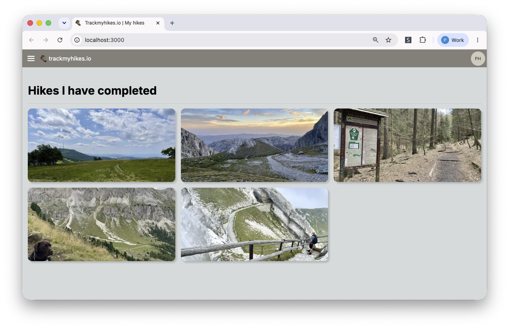

# Talk - Language agnostic E2E type safety with OpenAPI

This repository contains the source for a public talk I gave at Advanced JS meetup Amsterdam on September 20 2023.



## Software used

In this repository you will find source files for a next.js app router project on the UI and a Kotlin Spring starter project for the server.

OpenAPI generator is used to facilitate the communication between UI and server, by generating a fully (typescript) typed SDK for the UI and API models & controllers for the back-end.

**You can find the slides [here](https://github.com/patrickhuijten/language-agnostic-e2e-type-safety-with-openapi/blob/main/Language%20agnostic%20E2E%20type%20safety%20with%20OpenAPI%20Generator.pdf)!**

## Quickstart

Run the back-end and front-end in that order — the front-end's OpenAPI generation step reads the server's `api.yaml`, and the generated SDK expects the server to be reachable at runtime.

### 1. Start the back-end

From the `server` directory (see [`server/README.md`](./server/README.md) for JDK setup):

```sh
cd server
./gradlew bootRun
```

### 2. Generate the SDK on the front-end

From the `client` directory, generate the typed TypeScript SDK from `server/api.yaml`:

```sh
cd client
npm run openapi:generate
```

### 3. Install front-end dependencies

```sh
npm install
```

### 4. Start the front-end

```sh
npm run dev
```

The app is now available at [http://localhost:3000](http://localhost:3000).

## Updating the OpenAPI spec

`server/api.yaml` is the single source of truth for the API. Whenever it changes (new endpoint, new field, renamed model, etc.), both sides need to regenerate their bindings.

### 1. Regenerate the server bindings

From the `server` directory, regenerate the Spring API interfaces and models:

```sh
cd server
./gradlew openApiGenerate
```

Then restart the server so it picks up the new controllers and models:

```sh
./gradlew bootRun
```

### 2. Regenerate the client SDK

From the `client` directory, regenerate the typed TypeScript SDK:

```sh
cd client
npm run openapi:generate
```

The dev server will hot-reload with the updated types.
